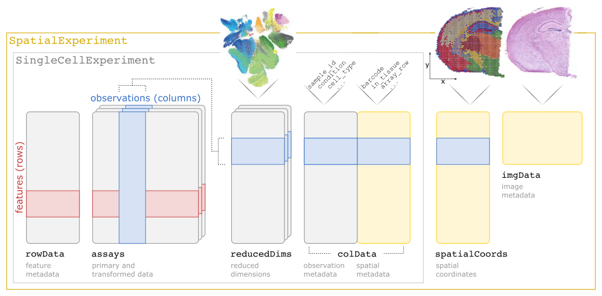
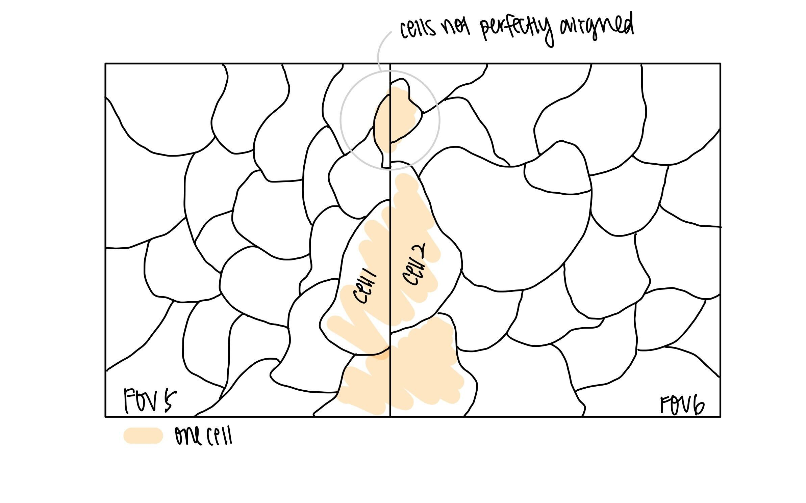
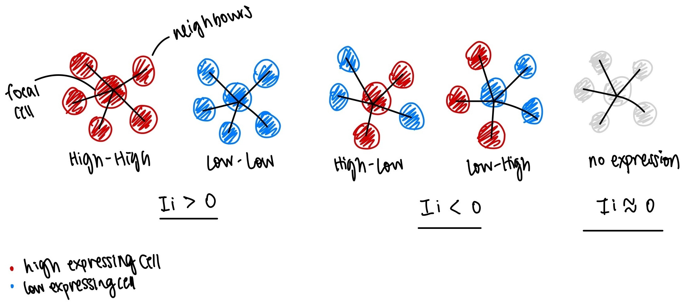
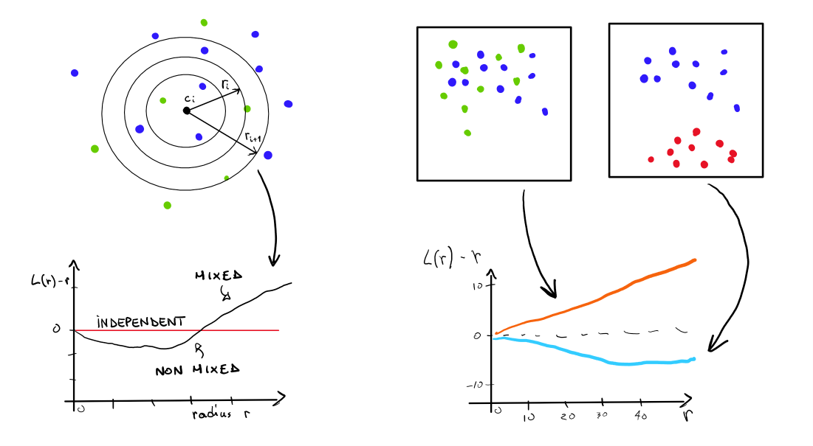

# Introduction

Spatial transcriptomics introduces exciting opportunities and analytical challenges to investigate how tissue architecture and extracellular
signalling within the microenvironment shape cellular identity and function across development, health, and disease. The multiple modalities of data - spatial coordinates, images and gene expression introduces greater potential to **interrogate advanced biological hypotheses**. However, the added complexity also introduces **technology-specific biases and artifacts**, together with important considerations during experimental design.

The theory behind generating spatial data and discussion of biases, artifacts and experimental design are covered in the accompanying slides. Here, we will walk through a basic spatial transcriptomics analysis workflow using the Bioconductor ecosystem. Specifically, we will analyse 1k-plex CosMx data (Bruker) on mouse brain tissue.

*First*, we will perform quality control and pre-processing where we explore how to meaningfully visualise spatial data and see how technical artifacts could manifest in the data. *Then*, we will characterise the data, including cell type annotatio and identification of marker genes. *Finally*, this demo will demonstrate the additional biological insights we can gain from leveraging spatial information such as neighbourhood analysis and cell-cell interaction analysis.

::: {.callout-note icon=false}

## Through this workshop, we will employ basic strategies to answer these critical questions:

1. What does my data look like?
2. What are the technical artifacts I need to be aware of?
3. Which genes are autocorrelated with space?
4. Which cell types are likely to be interacting based on their proximity?

:::

```{r load-libs, message=FALSE, warning=FALSE}
library(DESpace)
library(ggplot2)
library(dplyr)
library(tidyr)
library(OSTA.data)
library(patchwork)
library(pheatmap)
library(ggspavis)
library(scuttle)
library(scRNAseq)
library(scrapper)
library(sf)
library(SingleR)
library(SpaceTrooper)
library(spatialFDA)
library(SpatialExperiment)
library(SpatialExperimentIO)
library(SpatialFeatureExperiment)
library(grid)
library(spdep)
library(Voyager)
# set seed for random number generation in order to make results reproducible
set.seed(112358)
```

Throughout this tutorial, we will store our data in a `SpatialExperiment` (SPE) object. The `SpatialExperiment` class is an R/Bioconductor S4 class that extends upon the `SingleCellExperiment` class for single-cell data to support storage and retrieval of additional information from spot-based and molecule-based platforms, including spatial coordinates, images, and image metadata. 

The following schematic illustrates the SpatialExperiment class structure.



As shown, an object consists of: (i) assays containing expression counts, (ii) rowData containing information on features, i.e. genes, (iii) colData containing information on spots or cells, including nonspatial and spatial metadata, (iv) spatialCoords containing spatial coordinates, and (v) imgData containing image data.

# Quality control

## Importing CosMx data

`r BiocStyle::Biocpkg("SpatialExperimentIO")` provides functions to import CosMx (Bruker), Xenium (10x Genomics), and MERSCOPE (Vizgen) datasets into
`SingleCell/SpatialExperiment` objects, starting from the outputs provided by the three providers.

::: {.callout-note icon=false}

## Types of probes 
Commercially available panels can typically include three types of barcodes:

- **RNA targets** determine the 'plexity' of the panel.
- **Negative probes** serve to quantify non-specific binding.
- **System controls** serve to quantify spot calling errors.

:::

```{r load-data-cos, message=FALSE, warning=FALSE}
# retrieve CosMx dataset from OSF repo
id <- "CosMx1k_MouseBrain2"
pa <- OSTA.data_load(id, mol=FALSE)
dir.create(td <- tempfile())
unzip(pa, exdir=td)
cos <- readCosmxSXE(td, addTx=FALSE)

# prepare data for 'SpaceTrooper' 
cos <- updateCosmxSPE(cos, td, sampleName="CosMx")
cos <- readAndAddPolygonsToSPE(cos)
cos$in_tissue <- TRUE
cos
```

## Visualization

Imaging-based ST data relies on imaging a 2D tissue section. Hence, an advantage  compared to scRNA-seq is that we can readily visualize a 2D map of the cells and directly plot cell features onto the map. The easiest way to visualize the data is by representing the cells as centroids. This is useful to have a global bird's-eye-view of the tissue.

```{r plot-xy, fig.width=10, fig.height=5}
# points = cell centroids
plotCoords(cos, point_size=0, y_reverse = FALSE) + ggtitle(cos$sample_id)
```

Unlike, Xenium and MERSCOPE, CosMx does not stitch fields of view (FOVs) in a single image, but rather treats each FOV independently. It is therefore useful to visualize a map of the FOVs to understand their spatial arrangement.

```{r plot-fov-map, out.width="66%", fig.align="center"}
plotCellsFovs(cos)
```

## General QC metrics

Similarly to scRNA-seq, quality control (QC) is an important step to remove low-quality cells and highlights specific biases in the data at the sample, field of view (FOV), or slide area level. Unlike scRNA-seq and sequencing-based ST, however, most imaging-based ST platforms do not measure the transcriptome, nor an "unbiased" sample of it, but rely on the design of gene panels. 

Depending on the platform and the application, such gene panels may be pan-tissue or targeting specific tissues or cell types. Moreover, they vary from a few hundred (e.g., 313 in the first Xenium panel) to several thousands (e.g., the 5k Xenium panel or the 6k and 18k CosMx panels). Hence, unlike in sequencing-based platforms, we may not have enough ribosomal or mitochondrial transcripts to use for computing QC metrics. However, imaging-based platforms provide a set of negative probes that can be used to check for nonspecific RNA captures.

Finally, imaging-based platforms include, in addition to transcript data, morphology information (such as area and eccentricity of segmented cells) 
and information from antibody stains (such as those targeting cell nuclei or surface).

### Immunofluorescence staining

CosMx outputs, for instance, typically include the min/max/mean intensities 
of a set of immunofluorescence (IF) markers for, e.g., nuclei and cell surface 
(used for segmentation), as well as additional markers (experiment-dependent).
Here, we show the distribution of mean IF intensities across the CosMx sample.
[Values are arcsinh-transformed with a cofactor of 10 for visual purposes]{.aside}

```{r plot-cos-xy-dapi, message=FALSE, fig.width=12, fig.height=4}
#| code-fold: true
flu <- grepv("^Mean", names(colData(cos)))
lapply(flu, \(.) {
    cos[[.]] <- asinh(cos[[.]]/10)
    plotCoords(cos, annotate=., point_size=0, y_reverse = FALSE)
}) |>
    wrap_plots(nrow=1) &
    theme(
        legend.position="bottom", 
        legend.key.height=grid::unit(0.4, "lines")) &
    scale_color_gradientn(colors=pals::jet())
```

```{r gc-2, include=FALSE}
# garbage collection to reduce memory usage 
# for building book with GitHub Actions
gc()
```

### Morphology

`r BiocStyle::Biocpkg("SpaceTrooper")`'s `spatialPerCellQC` function can be 
used to compute a set of metrics that are particular to imaging-based ST data; 
examples listed below. 
In addition, the function incorporates an internal call to `quickRnaQc.se`
from the `r BiocStyle::Biocpkg("scrapper")` package to compute some standard 
scRNA-seq QC metrics on an `altExp`; here, we specify using negative probes.

::: {.aside}
Note that metrics also include each cell's distance from horizontal/vertical
and nearest FOV borders: `dist_border_x/y` and `dist_border`, respectively;
we will get back to this in @sec-img-quality-control-cos.
:::

```{r SpaceTrooper-qc, message=FALSE, warning=FALSE, echo=2:4}
old <- names(colData(cos))
# compute 'SpaceTrooper' QC metrics
cos <- spatialPerCellQC(cos, use_altexps="NegPrb")
# the following cell metadata are newly available:
setdiff(names(colData(cos)), old)
```

```{r gc-3, include=FALSE}
# garbage collection
# to reduce memory usage for building book with GitHub Actions
gc()
```

In particular, the following metrics have been added to the `colData`:

- `Area_um`: area in microns
- `SignalDensity`: count density = number of transcripts per area
- `log2AspectRatio`: log2 of the aspect ratio (x-/y-axis) of each cell
- `ctrl_total_ratio`: proportion of negative probe counts over total counts

### Counts \& area

Imaging-based ST data relies on imaging a 2D tissue section. Cells thus represent 
a slice through a 3D system, and we expect a tight relationship between a cell's 
counts and its area. When we inspect total counts and cell areas as separate 
(univariate) distributions, both appear approximately log-normal distributed.

```{r plot-qc-1d, fig.width=10, fig.height=3, warning=FALSE}
#| code-fold: true
.p <- \(df, xs) {
    fd <- pivot_longer(df, all_of(xs))
    mu <- summarise_at(group_by(fd, name), "value", median)
    ggplot(fd, aes(value)) + facet_grid(~ name) + 
        geom_histogram(bins=50, linewidth=0.1, fill="gray") + 
        geom_vline(data=mu, aes(xintercept=value), col="blue") + 
        geom_text(
            hjust=-0.1, size=3, col="blue", 
            data=mu, aes(value, 0, label=round(value))) + 
        scale_x_continuous(NULL, trans="log10") + ylab("# cells") + 
        theme_minimal() + theme(panel.grid.minor=element_blank())
}
df_cos <- data.frame(colData(cos), spatialCoords(cos))
.p(df_cos, c("Area_um", "total")) + ggtitle("CosMx")
```

Similarly, we can visualize the distribution of these metrics in the tissue 
by plotting cell centroids colored by total counts and cell area, respectively.

```{r include=FALSE}
# 'ggspavis' complains about duplicated entries
i <- setdiff(
    names(cd <- colData(cos)), 
    spatialCoordsNames(cos))
colData(cos) <- cd[i]
```

```{r plot-qc-xy, message=FALSE, fig.width=12, fig.height=4}
#| code-fold: true
lapply(c("Area_um", "total"), \(.) {
    # crop very low/high values for clearer visualization
    val <- cos[[.]]
    qs <- quantile(val, c(0.01, 0.99))
    val <- ifelse(val < qs[1], qs[1], ifelse(val > qs[2], qs[2], val))
    cos[[.]] <- val
    plotCoords(cos, annotate=., point_size=0, y_reverse = FALSE) +
         theme(legend.key.width=grid::unit(0.5, "lines")) +
        scale_color_gradientn(colors=unname(pals::jet()), trans="log10")
}) |> wrap_plots(nrow=1)
```

In a bivariate setting, we observe a positive relationship between counts and area (as expected).

```{r plot-qc-2d-one, message=FALSE, warning=FALSE, fig.width=6, fig.height=3}
#| code-fold: true
.p <- \(df, x, y) {
    ggplot(df, aes(.data[[x]], .data[[y]])) + 
        geom_point(shape=16, size=0, alpha=0.1) + 
        geom_smooth(method="lm", col="blue") +
        scale_x_log10() + scale_y_log10() +
        theme_minimal() + theme(
            aspect.ratio=1, 
            panel.grid.minor=element_blank())
}
.p(df_cos, "Area_um", "total") + ggtitle("CosMx")
```

In some cases, a peculiar count-area distribution might be indicative of 
segmentation problems. Undersegmentation (i.e., when groups of cells are 
merged together) might lead to fewer counts than expected for a given 
area (e.g., when they are far apart and empty space is being segmented).
[A useful metric to explore this issue is the `log2SignalDensity`,
which estimates the transcript density for each cell.]{.aside}

## CosMx-specific QC {#sec-img-quality-control-cos}

### Fields of view (FOVs)

Imaging-based ST data from CosMx are acquired through iterative imaging 
of predefined rectangular regions, so-called fields of view (FOV).

Unlike Xenium and MERSCOPE, standard CosMx pipelines do not stitch FOVs, but 
rather treat each FOV independently. The `colData` of the `SpatialExperiment` 
object resulting from a CosMx data import will include the FOV of each cell, 
but it is sometimes tricky to understand (or remember) the relative position 
of each FOV within the slide. 

`r BiocStyle::Biocpkg("SpaceTrooper")`'s `plotZoomFovsMap` function provides an 
easy way to map FOVs within the slide, allowing to zoom in on a subset of FOVs, 
while visualizing the global structure of the tissue.

```{r plot-cos-fov, warning=FALSE, fig.width=10, fig.height=5}
plotZoomFovsMap(cos, 
    mapPointCol="green",
    colourBy="Mean.DAPI",
    fovs=c(98:100, 113:115, 122:124))
```

Assuming FOV placement aims to capture biologically interesting regions -- 
regions of interest (ROIs) -- we would expect every FOV to capture a decent 
number of cells. Issues in image registration or IF staining, however, may 
affect spot calling and cell segmentation, and can yield FOVs with virtually 
no cells. We thus advice inspecting the number of cells across FOVs:

```{r cos-plot-ns, fig.height=2, out.width="100%"}
#| code-fold: true
ns <- as.data.frame(
    table(fov=cos$fov), 
    responseName="n_cells")
ggplot(ns, aes(fov, n_cells)) + 
    scale_x_discrete(breaks=c(1, seq(5, max(cos$fov), 5))) +
    scale_y_continuous(limits=c(0, 1e3), n.breaks=4) +
    labs(x="field of view (FOV)", y="# cells") +
    geom_col(fill="grey", alpha=2/3) +
    coord_cartesian(expand=FALSE) +
    theme_bw()
```

It is generally also worth checking that basic QC metrics do not vary across FOVs.
Of course, such effects will also be driven by differences in subpopulation composition across FOVs.
However, gross differences in detection efficacy, IF staining, spot calling, segmentation, etc. often still manifest in FOV-level shifts in IF stains and/or RNA target, negative probe, system control counts.
A simple spot-check is the following type of visualization, but more thorough investigation is advisable 'in the wild', especially so in challenging types of tissue:

```{r cos-plot-qc, warning=FALSE, fig.width=10, fig.height=5}
#| code-fold: true
df <- data.frame(colData(cos))
ys <- c("detected", "total", "Area_um", "log2SignalDensity")
ys <- c(grepv("Mean", names(df)), ys)
fd <- pivot_longer(df, ys) |>
    mutate(value=case_when(
        grepl("Mean", name) ~ asinh(value),
        grepl("total", name) ~ log10(value),
        grepl("^Area", name) ~ log10(value),
        TRUE ~ value), fov=factor(fov))
ggplot(fd, aes(fov, value, fill=fov)) + 
    facet_wrap(~name, nrow=3, scales="free_y") +
    geom_boxplot(linewidth=0.2, outlier.size=0.2) +
    scale_x_discrete(breaks=c(1, seq(10, max(cos$fov), 10))) +
    theme_minimal() + theme(legend.position="none") +
    labs(x="field of view (FOV)", y=NULL)
```

In our example, DAPI stains, RNA target counts (`total`), and the number of
uniquely detected RNA targets (`detected`) are fairly constant across FOVs; 
systematic differences seem to reflect morphological differences across FOVs.
Taken together, we cannot deem any FOVs as being obviously problematic here.

### Border effects

Particularly in CosMx, lack of FOV stitching during cell segmentation can result 
in fractured and possibly duplicated cells. To investigate potential artifacts
related to this, we can use the distance to FOV borders calculated previously.



We can *roughly* estimate cell radii as $A=\pi r^2$ $\leftrightarrow r=\sqrt{A/\pi}$, 
and use this as a threshold on FOV border distances; i.e., we flag a cell when 
its centroid is closer to any border than the radius of an average circular cell.

```{r cos-est-rad}
(r <- sqrt(mean(cos$Area)/pi))
```

Now, let us visualize total RNA counts against distance to FOV borders, 
setting the above estimate for radius `r` as a threshold on the latter; 
we also include rolling means to better highlight global trends:

```{r cos-plot-ds, message=FALSE, warning=FALSE, fig.width=9, fig.height=4}
#| code-fold: true
df <- data.frame(colData(cos))
.p <- \(df, x, y) {
    ggplot(df, aes(.data[[x]], .data[[y]])) +
        geom_point(color="grey", size=0) +
        geom_smooth() + theme_minimal() +
        geom_vline(xintercept=r, col="red") +
        geom_vline(xintercept=50, linetype=2)
}
p1 <- .p(df, "dist_border", "total") + xlim(0, 500) + ylim(0, 2000)
p2 <- .p(df, "dist_border", "Area_um") + xlim(0, 500) + ylim(0, 200)
p3 <- .p(df, "dist_border_x", "log2AspectRatio") + xlim(0, 500)
p4 <- .p(df, "dist_border_y", "log2AspectRatio") + xlim(0, 500)
(p1 + p2) / (p3 + p4) 
```

As expected, we observe a decline in counts near FOV borders, with about 
`r round(100*mean(df$dist_border < r), 1)`% of cells falling below $r$ (red line) and 
`r round(100*mean(df$dist_border < 50), 1)`% of cells falling below 50 pixels (dashed line).

These cells exhibit lower total counts and smaller segmented areas, 
as well as a distortion in their aspect ratio (thin cells close to
the y border and broad cells close to the x border).

To mitigate potential artifacts in downstream analyses, we may choose to filter
out these cells, or otherwise flag them as potentially problematic events to be 
kept a cautionary eye on. 

```{r cos-plot-ex, warning=FALSE, fig.width=5, fig.height=5}
#| code-fold: true
#| layout-ncol: 2
# highlight border cells across 
# the tissue (using cell centroids)
cos$ex <- df$dist_border < r
plotCentroids(cos, colourBy="ex", sampleId=NULL) +
    scale_color_manual(values=c("lavender", "blue")) +
    guides(col=guide_legend(override.aes=list(size=2))) +
    theme_void() + theme(legend.key.size=grid::unit(0, "pt"))
    
# zoom in on subset of FOVs
# visualizing cell boundaries
fs <- c(98:100, 113:115, 122:124)
plotPolygons(
    cos[, cos$fov %in% fs], 
    colourBy="ex", sampleId=NULL,
    borderCol="black", palette=c("lavender", "blue")) +
    theme(legend.position="none")
```

## Identifying low-quality cells

We can now use the QC metrics calculated above to flag 
(and potentially remove) low-quality cells.

### Individual metrics

First, we can consider metrics separately looking for outliers in their distribution.
Depending on the metric, we are interested in low-end or high-end outliers (or both). 
For instance, we may want to exclude too small/large cells as potential artifacts.

`r BiocStyle::Biocpkg("SpaceTrooper")` provides a function to compute outliers 
of the distribution of any QC metric present in the `colData` of the object. 
We can then visualize the distribution and outlier threshold with a histogram.

```{r SpaceTrooper-ol-cos, fig.height=2.5, fig.width=10}
cos <- computeSpatialOutlier(cos, computeBy="total", method="mc")
cos <- computeSpatialOutlier(cos, computeBy="Area_um", method="mc")
plotMetricHist(cos, metric="total", useFences="total_outlier_mc") +
plotMetricHist(cos, metric="Area_um", useFences="Area_um_outlier_mc")
```

In the CosMx data, we identify `r sum(cos$total_outlier_mc != "NO")` outliers 
for total counts and `r sum(cos$Area_um_outlier_mc != "NO")` outliers for area.

### Combined score

Finally, we can compute an aggregated quality score, which combines a cell's 
transcript density, aspect ratio and (for CosMx) distance from FOV borders.

Specifically, `r BiocStyle::Biocpkg("SpaceTrooper")`'s `computeQCScore` function will compute a combined quality score based on count density (`log2SignalDensity`), cell aspect ratio (`log2AspectRatio`), only for cells closer than a specified distance from FOV borders, and control-to-total count ratio (`log2Ctrl_total_ratio`). The count density is computed as the ratio between the per cell total gene counts divided by the cell area; the aspect ratio represents FOV border effect typical of CosMx datasets; the control-to-total ratio is the ratio between counts for control probes and total counts per cell and represents nonspecific signal.

::: {.aside}
The quality score is computed using a ridge logistic regression model, which predicts a score between 0 and 1, where higher scores indicate better quality cells, using the following model formula: `~(log2SignalDensity + Area_um + log2Ctrl_total_ratio + I(abs(log2AspectRatio) * as.numeric(dist_border<50)))^2`, where the `^2` notation indicates all pairwise interactions among the included variables. See `?computeQCScore` for details.
:::

Here, `computeQCScore()` will add a (numeric) `QC_score`, 
and `computeQCScoreFlags` will add a (logical) `low_qcscore` slot
to the input SPE's `colData`; the latter flags low-quality cells.

```{r SpaceTrooper-calc-score, message=FALSE}
# compute quality scores & flag cells that
# fall below specified percentile threshold
cos <- computeQCScore(cos)
cos <- computeQCScoreFlags(cos, 
    qsThreshold=0.5)

# the following slots have now been 
# added to the object's cell metadata
nms <- names(colData(cos))
sco <- grepv("score$", nms)
head(colData(cos)[sco])
```

```{r SpaceTrooper-plot-score, message=FALSE, fig.width=10, fig.height=5}
#| code-fold: true
# visualize quality scores & highlight flagged cells
thm <- list(theme_void(), ggtitle(""), coord_equal())
plotCentroids(cos, colourBy="QC_score") + thm +
plotCentroids(cos, colourBy="low_qcscore") + thm +
    guides(col=guide_legend(override.aes=list(size=2))) +
    scale_color_manual(values=c("lavender", "blue")) +
    theme(legend.key.size=grid::unit(0, "pt")) 
```

We can see how the QC score flags several cells close to the tissue border as well as cells close to the FOVs borders. 

## Filtering {#sec-img-quality-control-fil}

Using `SpaceTrooper`s quality score, we will filter the CosMx dataset
which would exclude about `r round(100*mean(cos$low_qcscore))`\% of cells.

```{r cos-ex}
# fraction of low-quality CosMx cells
mean(cos$low_qcscore)
```

## Conclusion

In a stringent analysis, we may want to remove low-quality cells, but this has 
to be done with caution: **before excluding any cells, it is recommendable to 
inspect where these fall in the tissue**. We would expect low-quality cells to 
be distributed randomly, and otherwise to accumulate at the tissue or FOV borders or 
in regions were tissue was, for example, smudged, detached, necrotic etc.

In general, **spatially organized clusters of excluded cells might indicate a 
bias towards excluding specific types of cells** (e.g., some immune cells tend to 
be smaller or might otherwise contain fewer transcripts due to the panel design).
Whenever possible, we advice readers to cross-check visualizations like the 
following with a corresponding H&E stain of the tissue, considering possible 
experimental faults as well as their prior knowledge on tissue pathology.

# Intermediate processing

For the sake of runtime, we will perform downstream analyses only on
a small portion of the tissue, defined by the following FOVs:

```{r subset-fovs-cosmx, results="hold", message=FALSE}
fs <- c(72:74, 90:92, 97:99, 114:116)
plotZoomFovsMap(cos, fovs=fs)
sub <- cos[, cos$fov %in% fs]
```

## Normalization

Normalization is a critical step in the analysis of transcriptomics and other high-throughput biological data, aiming to remove technical variability while preserving true biological signals.

In single-cell RNA sequencing, normalization aims at removing differences in sequencing coverage between libraries (cells). Such differences in _library size_ are typically accounted for by scaling the counts in each cell by a size factor, which is often computed as the total number of counts for that cell (or a robust variant thereof); see [OSCA](https://bioconductor.org/books/release/OSCA.basic/normalization.html).

Single-cell normalization methods have been widely used for the analysis of spatial transcriptomics (ST) data, given the similarity between the two technologies, which both yield count data. While this is justifiable for sequencing-based ST technologies, it is less clear that this is appropriate for imaging-based ones.

In fact, in imaging-based ST, the total number of counts is driven by the number of probes that successfully hybridize to their target transcripts within each cell and not by the sequencing coverage. It is hence less clear that this leads to the same compositional biases as in sequencing platforms. Moreover, these technologies often employ targeted gene panels rather than whole-transcriptome profiling, which may lead to confounding between total counts and biology, as shown by @Atta2024-gene-count and @Bhuva2024-library-size.

### Cell area-based normalization

An alternative to log-library size normalization is normalization by cell area (or volume). In principle, this is equivalent to assuming a constant transcription rate across cells and focusing on transcript density, rather than transcript counts, as a measure of gene expression.

Nevertheless, it is important to highlight that cell area itself is not known a priori, but rather estimated through segmentation algorithms that may introduce errors, which can impact the final results.

To compute area-derived size factors, we can use the `cell_area` column in the `colData` of the `spe` object, which contains the area of each cell as estimated by the segmentation.

```{r pro}
# cell area-based normalization
sfs <- (. <- sub$Area) / median(.)
sub <- normalizeRnaCounts.se(sub, size.factors=sfs)
```

### Extension: Comparing Normalization Methods

Log-library size normalization is the simplest normalization strategy and the default option in several single-cell RNA-seq workflows. It normalizes the data by dividing each count by the column sums and rescaling them so that the original scale of the counts is preserved. Finally, the resulting normalized data are log-transformed after adding a pseudo-count, typically one, to avoid issues with the log of zero.

For the purposes of demonstration, we will use a 313-plex Xenium data (10x Genomics) of a human breast cancer biopsy section from @Janesick2023-high-res.

```{r load-data}
spe <- readRDS("img-spe_qc.rds")
id <- "Xenium_HumanBreast1_Janesick"
pa <- OSTA.data_load(id, mol=FALSE)
dir.create(td <- tempfile())
unzip(pa, "annotation.csv", exdir=td)
df <- read.csv(list.files(td, full.names=TRUE))
# add annotations as cell metadata
cs <- match(spe$cell_id, df$Barcode)
spe$Label <- df$Annotation[cs]
```

As a baseline, we will apply log-library size normalization, as implemented in the `r BiocStyle::Biocpkg("scrapper")` package. 
Note that the `normalizeRnaCounts.se` function adds a new assay named `logcounts` to the `spe` object, which contains the normalized expression values on the log scale.

```{r norm-log}
spe <- spe[, colSums(assay(spe, "counts")) > 0]
spe <- normalizeRnaCounts.se(spe)
spe$sf_lib <- sizeFactors(spe)
assayNames(spe)
```

We will also normalise by area-derived size factors as a comparison.

```{r norm-area}
spe$sf_area <- (. <- spe$cell_area) / median(.)
spe <- normalizeRnaCounts.se(spe, 
    size.factors=spe$sf_area,
    output.name="normalized_by_area")
```

We can check the distribution of library and area-derived size factors across cell types, to highlight any potential confounding variables:

```{r plot-size-factors-boxplot, fig.width=9, fig.height=5}
#| code-fold: true
df <- data.frame(colData(spe), spatialCoords(spe))
p1 <- ggplot(df, aes(y=sf_lib)) + ggtitle("Library size factors") 
p2 <- ggplot(df, aes(y=sf_area)) + ggtitle("Area-derived factors") 
(p1 + p2) &
    geom_boxplot(aes(Label, fill=Label)) &
    labs(x="Cell type", y="Size factor") &
    scale_fill_manual(values=unname(pals::tableau20())) &
    theme_bw() & theme(
        aspect.ratio=1,
        legend.position="none",
        panel.grid.minor=element_blank(),
        plot.title=element_text(hjust=0.5),
        axis.text.x=element_text(angle=45, hjust=1))
```

We can clearly see that library size factors of tumor cells are systematically higher than those of other cell types, which is a sign of confounding between library size and biology.

We can also compare the area-derived scaling factors with the library size factors:

```{r plot-size-factors-scatter, fig.width=6, fig.height=5}
#| code-fold: true
ggplot(df, aes(sf_area, sf_lib)) + 
    geom_point(shape=16, stroke=0, size=0.4) +
    geom_abline(linewidth=0.4, col="blue") + 
    facet_wrap(~Label) +
    labs(x="Area-derived factor", y="Library size factor") + 
    ggtitle("Relation between area-derived and library size factors") +
    coord_equal() + theme_bw() + theme(
        panel.grid.minor=element_blank(),
        plot.title=element_text(hjust=0.5))
```

While there is a general correlation between total counts and cell area, the relationship is cell-type specific, with tumor cells showing systematically higher counts for a given area, and stromal cells showing generally larger areas.

This suggests that the choice of normalization may have a significant impact on downstream analyses, and should be carefully considered in the context of the specific dataset and biological questions at hand.

We next look at the difference in normalized expression values between the two normalization methods, and select the top 10 genes that show the largest differences.

```{r top-genes}
mean_libs <- rowMeans(assays(spe)$logcounts)
mean_area <- rowMeans(assays(spe)$normalized_by_area)
diff <- abs(mean_libs - mean_area)
ord <- order(diff, decreasing=TRUE)
top_diff <- diff[ord[1:10]]
names(top_diff)
```

By looking at the top genes, we can see several epithelial cell markers, such as EPCAM, KRT8, and KRT7.

Interestingly, looking at the expression of EPCAM across the tissue, we can see that area normalization enhances the contrast between tumor and non-tumor regions, while library size normalization yields a more diffuse expression pattern.

```{r plot-genes, fig.height=4, fig.width=10}
#| code-fold: true
cd <- data.frame(colData(spe), spatialCoords(spe))

mx <- logcounts(spe)[ord[1:10], ]
df_ls <- cbind(cd, as.matrix(t(mx)))

mx <- assay(spe, "normalized_by_area")[ord[1:10], ]
df_area <- cbind(cd, as.matrix(t(mx)))

p1 <- ggplot(df_ls) + labs(title="Library size normalization")
p2 <- ggplot(df_area) + labs(title="Area normalization") 

(p1 + p2) & 
    geom_point(
        aes(x_centroid, y_centroid, col=EPCAM), 
        shape=16, stroke=0, size=0.4) &
    scale_color_viridis_c() & coord_equal() & 
    theme_void() & theme(legend.position="bottom")
```

This is even clearer when looking at the expression of EPCAM stratified by cell type.

```{r plot-genes-box, fig.width=9, fig.height=6}
#| code-fold: true
(p1 + p2) &
    geom_boxplot(
        aes(Label, EPCAM, fill=Label), 
        outlier.shape=16, outlier.stroke=0) &
    scale_fill_manual(values=unname(pals::tableau20())) &
    labs(x="Cell type", y="EPCAM expression") &
    theme_bw() & theme(
        aspect.ratio=1,
        legend.position="none",
        panel.grid.minor=element_blank(),
        plot.title=element_text(hjust=0.5),
        axis.text.x=element_text(angle=45, hjust=1))
```

::: {.callout-note icon=false}

## Spatially-aware normalization

`r BiocStyle::Biocpkg("SpaNorm")` [@Salim2025-SpaNorm] is a spatially-aware normalization method that uses spatial information alongside gene expression to decompose spatially-smoothed variation into a technical and biological component. Using generalized linear models and percentile-invariant adjusted counts, `SpaNorm` provides normalized expression values for downstream analyses. [Given the high computational cost of `SpaNorm`, we do not run it here; we refer to the package vignette for details.]

:::

## Cell Type Annotation

Here, we use the @zeisel2015cell dataset as a reference to annotate the cell types with `r BiocStyle::Biocpkg("SingleR")`.

```{r load-ref-cosmx}
sceZ <- ZeiselBrainData()
sceZ <- normalizeRnaCounts.se(sceZ)
```

```{r annot-cosmx, message=FALSE}
pred <- SingleR(
    test=sub, ref=sceZ, 
    de.method="wilcox",
    labels=sceZ$level1class)

sub$SingleR_label <- factor(pred$pruned.labels)
nk <- nlevels(sub$SingleR_label)
pal <- hcl.colors(nk, "Spectral")

plotPolygons(sub, 
    colourBy="SingleR_label") +
    scale_fill_manual(values=pal)
```

Note that the annotation performed here is a transfer label from a reference dataset that only partially matches with the tissue under study and purposely annotated at a coarse level (level 1). Ideally, one can use a more appropriate reference dataset, or better yet, build a custom reference from single-cell RNA-seq data of the same tissue.

::: {.aside}
A different, often preferable, approach consists of using, in addition to the gene expression profiles, the image data and the spatial context of the cells. `r BiocStyle::Githubpkg("Nanostring-Biostats/InSituType", "InSituType")` [@danaher2022insitutype] provides a framework to perform such analysis in unsupervised, semi-supervised, or supervised manners. Please refer to its documentation for more details.
:::

## Marker genes

Here, we identify cluster-related spatially-variable genes using the `r BiocStyle::Biocpkg("DESpace")` package [@Cai2024-DESpace]. In this workflow, we use this as a way to identify marker genes for the cell types annotated above.

```{r svg-cosmx, message=FALSE}
res <- svg_test(spe=sub, cluster_col="SingleR_label")
head(res$gene_results)
```

We focus on the genes with the smallest p-values, and compute the average expression of each gene in each cell type. We can visualize this with a heatmap.

```{r plt-svg, fig.width=8, fig.height=3}
df <- res$gene_results
gs <- df$gene_id[rank(df$PValue, ties.method="min") == 1]
mu <- t(apply(counts(sub)[gs, ], 1, tapply, sub$SingleR_label, mean))

pheatmap(t(mu), 
    scale="column", show_colnames=FALSE,
    cluster_rows=TRUE, cluster_cols=TRUE, 
    main="Average expression of top SVGs per cell type")
```

We can also visualize the spatial distribution of some of these genes, e.g., Mbp that marks oligodendrocytes, and Calm1, Calm2, and Snap25 that mark different subsets of neurons. Note also how some genes show a difference of expression within the pyramidal neuron population, suggesting the presence of subtypes.

```{r plt-svg-genes, fig.width=10, fig.height=7, message=FALSE}
gs <- c("Mbp", "Calm1", "Calm2", "Snap25")
ps <- lapply(gs, \(g) {
    sub[[g]] <- logcounts(sub)[g, ]
    plotPolygons(sub, colourBy=g) + ggtitle(g)
}) 
dy <- range(logcounts(sub)[gs, ])
wrap_plots(ps, guides="collect") &
    scale_fill_viridis_c(
        "expression", 
        limits=dy, breaks=dy,
        labels=c("low", "high")) &
    theme(plot.title=element_text(hjust=0.5))
```

## Neighborhood-based gene expression analyses

We start by creating a cell neighborhood graph, based on a distance threshold of 50 microns. To do so, we use the `r BiocStyle::Biocpkg("SpatialFeatureExperiment")` package [@Moses2023-Voyager]. The `findSpatialNeighbors` function, using the `poly2nb` method builds a neighbours list based on polygons with contiguous boundaries, that is sharing one or more boundary point. Boundary points less than `snap` distance apart  are considered to indicate contiguity; used both to find candidate and actual neighbours for planar geometries. The default condition to be considered a 'neighbour cell' requires that a single shared boundary point meets the contiguity condition.


::: {.aside}
Note that an alternative approach uses the $k$ nearest neighbors (kNN) method to define the neighborhood graph. Here, we prefer to use a distance-based approach, as it better captures the morphological structure of this tissue area.
:::

```{r cci-graph-cosmx, warning=FALSE}
# convert to SFE & remove cells with NA labels
sfe <- as(sub, "SpatialFeatureExperiment")
sfe <- sfe[, !is.na(sfe$SingleR_label)]

# this is needed for Voyager's plotting functions
colnames(sfe$polygons)[6] <- "geometry"
st_geometry(sfe$polygons) <- "geometry"
colGeometry(sfe, "cellSeg") <- sfe$polygons

colGraph(sfe, "poly2nb") <- 
    findSpatialNeighbors(sfe,
        type="cellSeg", 
        method="poly2nb", 
        style="W", snap=50)

plotColGraph(sfe, 
    colGraphName="poly2nb", 
    colGeometryName="cellSeg") + 
    theme_void()
```

Given the neighborhood graph, we can calculate local measures of spatial autocorrelation for specific genes in the dataset.

Here, we focus on Snap25 and Calm1, neuronal marker genes identified above that show interesting spatial expression distributions (see above). First, we compute the local Moran's I coefficient.

::: {.callout-note icon=false}

## Local Moran's I explained in simple terms

For each cell, the local Moran's I coefficient is the product of a cell's deviation from the global mean expression and the average deviation of its neighbours. Positive values indicate the cell is surrounded by similarly-expressing neighbours (a local cluster, either high or lowly expressed); negative values indicate it sits among dissimilar neighbours (a spatial outlier).

Interpretation of coefficient:

- Ii > 0 → cellular expression similar to neighbours (hot/cold spots)
- Ii = 0 → minimal local spatial association
- Ii < 0 → cellular expression different from neighbours (outliers)

:::



```{r cci-moran-snap25, fig.width=8, fig.height=3}
gs <- c("Snap25", "Calm1")
sfe <- runUnivariate(sfe,
    features=gs,
    type="localmoran",
    zero.policy=TRUE,
    colGraphName="poly2nb",
    colGeometryName="cellSeg")

plotLocalResult(sfe, 
    name="localmoran",
    features=gs, ncol=2,
    colGeometryName="cellSeg",
    divergent=TRUE, diverge_center=0)

# to view statistics for individual genes
# gene_result <- localResult(sfe, type = "localmoran", feature = "Snap25")
```

From the plots, we can see that Snap25 shows positive spatial autocorrelation in a very localized part of the tissue, while Calm1 shows a more diffuse autocorrelation structure.

We focus on Snap25 and visualize its autocorrelation structure using a Moran scatter plot, which shows the relationship between the expression of the gene in each cell and the average expression in its neighbors.

```{r cci-moran-scatter-snap25}
sfe <- runUnivariate(sfe,
    feature=gs[1],
    zero.policy=TRUE,
    type="moran.plot",
    colGraphName="poly2nb",
    colGeometryName="cellSeg")

moranPlot(sfe,
    feature=gs[1],
    graphName="poly2nb",
    swap_rownames="symbol")
```

We can then classify cells based on the significance of their local Moran's I values, and visualize the resulting clusters in the spatial context.

```{r cci-moran-scatter-sig}
res <- localResults(sfe)[["localmoran"]][[1]]
res$locClust <- with(res, ifelse(
    `-log10p_adj` > -log10(0.05), 
    as.character(mean), "non-significant"))
localResults(sfe)[["localmoran"]][[1]] <- res

plotLocalResult(sfe,
    features=gs[1],
    name="localmoran",
    attribute="locClust",
    colGeometryName="cellSeg")
```

In this case, we can see a significant positive autocorrelation in the lower left part of the structure, while the rest of the tissue does not show significant autocorrelation.

::: {.aside}
Note that other local spatial autocorrelation measures, such as Geary's C coefficient and Getis-Ord statistic, as well as their global versions can be used for similar analyses [@Emons2025-pasta,@Moses2023-Voyager].
:::

## Cell-cell interactions

To investigate the likelihood of cells interacting with each other based on spatial proximity, we look at point patterns, such as Ripley's K function, and similar methods, using for instance the `r BiocStyle::Biocpkg("spatialFDA")` package.

Here, we use Besag's L function to quantify the interaction between pyramidal CA1 neurons, and the interaction between them and oligodendrocytes (cross-L function).

::: {.callout-note icon=false}

## L-functions explained in simple terms

For the *univariate L-function*, we pick a single focal CA1 neuron, draw a circle of radius `r` around it, and count how many other CA1 neurons fall inside that circle. We do this for every CA1 neuron and every radius, then compare those counts to what you'd expect if the two cell types were scattered independently of each other (ie. randomly distributed)

If CA1 neurons are seen together more often than by chance, they are clustered. If there are very few, the cell types are repelling each other.

A cross-L function follows the same principle, except we are interested in the clustering of two cell types in relation to each other. Similarly, we count the number of other cell types within the radius of the focal cell type.

Interpretation of L-score:

- L(r) > 0 → cells are clustering at the specified distance given by `rSeq`
- L(r) = 0 → cells are randomly distributed
- L(r) < 0 → cells are repelling each other 

:::



::: {.aside}
Other methods are available, such as Ripley's K function, and the pair correlation function [@Emons2025-pasta]. Note that here we are making the quite strong assumption of homogeneity of the point pattern, which is unrealistic in tissue biology. In particular, CSR is a naïve null model that does not take into account tissue structure and cell density variations across the tissue. Hence, these plots should be considered as exploratory analyses rather than formal hypothesis tests.
:::

```{r cci-CA1-l, fig.width=6, fig.height=4, message=FALSE}
res <- calcMetricPerFov(
    spe=sub, fun="Lest",
    subsetby="sample_id", 
    marks="SingleR_label",
    selection="pyramidal CA1",
    rSeq=seq(0, 500, l=100),
    by="sample_id", ncores=1)

plotMetricPerFov(res, 
    theo=TRUE, correction="iso", 
    x="r", imageId="sample_id")
```

In this type of plots, the dashed line represents the theoretical value of the metric under complete spatial randomness (CSR). Values above this line indicate clustering, while values below indicate dispersion. Here, we can see that pyramidal CA1 neurons tend to cluster together, as expected.

::: {.aside}
Note that the L-function lays below the CSR line for the first 50 microns, which is a consequence of the cell segmentation that does not allow cells to overlap, indicating the impossibility of finding two cells at a distance smaller than their size.
:::

While in the plot above we focused on a single cell type, we can also investigate the interaction between two different cell types, e.g., pyramidal CA1 neurons and oligodendrocytes, using the cross-L function.

```{r cci-cross-l, fig.width=6, fig.height=4, message=FALSE}
res <- calcMetricPerFov(
    spe=sub, fun="Lcross", 
    subsetby="sample_id", 
    marks="SingleR_label",
    selection=c("pyramidal CA1", "oligodendrocytes"),
    rSeq=seq(0, 500, l=100),
    by="sample_id", ncores=1)

plotMetricPerFov(res, 
    theo=TRUE, correction="iso", 
    x="r", imageId="sample_id")
```

In this case, we can see that pyramidal CA1 neurons and oligodendrocytes tend to be spatially segregated, as indicated by the cross-L function being below the CSR line.

We only briefly discussed cell-cell interactions and spatial exploratory analyses here: we refer interested readers to the comprehensive documentation and tutorials available at the [pasta](https://robinsonlabuzh.github.io/pasta/00-home.html) and [Voyager](https://pachterlab.github.io/voyager/) websites.

# Appendix

::: {.callout-tip icon="false" title="Further reading"}

- Bruker's [CosMx Analysis Scratch Space](https://nanostring-biostats.github.io/CosMx-Analysis-Scratch-Space/about.html) 
provides a large variety of (mostly R-based) tutorial-style notebooks --
specifically for CosMx data from AtoMx exports -- that include file handling, 
image exploration, quality control, and a variety of downstream analysis tasks.

- @He2022-CosMx (1K-plex) and @Khafizov2024-CosMx (whole-transcriptome) 
describe the biotechnology underlying CosMx. While these studies were 
authored by industry-affiliated researchers, they remain informative 
references for understanding the platform (and potential data issues).

:::

# Session information

For reproducibility, the exact R and package versions used to render the workshop
are reported below.

```{r session-info}
sessionInfo()
```